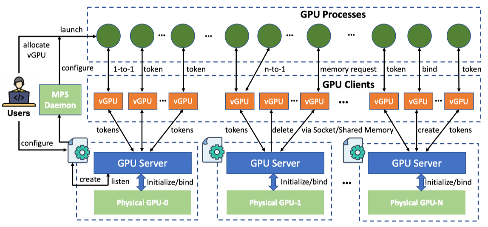

## Fine-grained GPU Sharing and Isolation Sub-System

`ST-vGPU` is an independent spatio-temporal GPU resource sharing and isolation architecture implemented entirely in the user space of the operating system.

`ST-vGPU` consists of three key components, namely GPU Servers, GPU Clients (vGPUs), and GPU Processes. The GPU Server is the control component that manages all physical GPUs in a node, with each GPU Server bound to a specific physical GPU. The GPU Server is responsible for creating, destroying, scheduling, and allocating resources for vGPUs in the GPU client layer. In ST-vGPU, a GPU Server can dynamically instantiate multiple vGPUs at runtime and on demand according to varying spatial and temporal GPU resource requirements. A vGPU is a logical partition of a physical GPU and represents the allocation and isolation of spatio-temporal GPU resources when multiple applications share the GPU. The vGPU requests GPU resources in real time by sending the token to the GPU Server. Meanwhile, the GPU Server controls and coordinates resource usage among multiple vGPUs by allocating tokens. A token is a GPU time slice, serving as the time unit that a vGPU or application can execute on the GPU. When a vGPU or application exhausts its allocated time slice, it can apply for new execution time by continuously sending token requests to its upper layers. At the GPU process level, a process acquires GPU resources by sending token requests or memory requests to its associated vGPU. In most cases, a vGPU is bound one-to-one with a GPU process to ensure inter-application isolation. Moreover, when multiple processes do not require isolation and need to share the same vGPU, a multiple-to-one mapping can also be flexibly adopted.